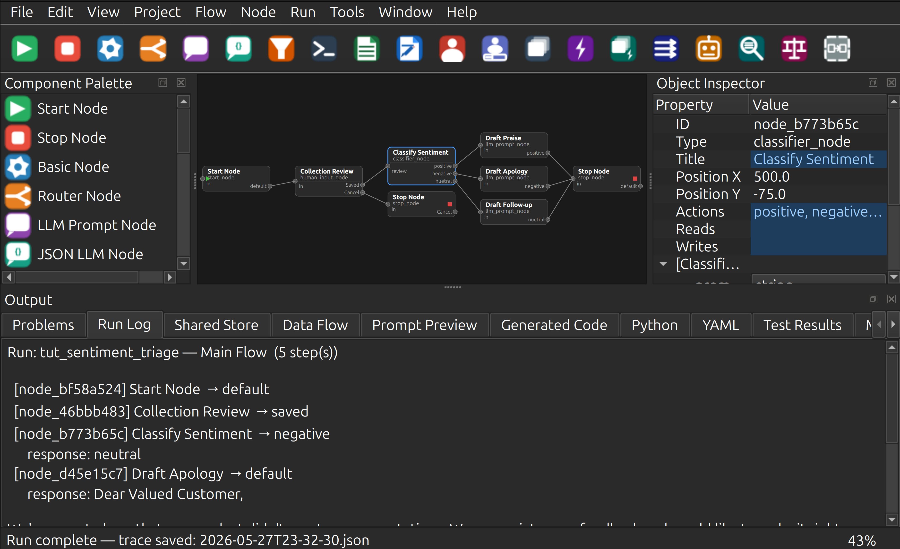

# PocketFlow Creator

[](https://github.com/Monotoba/PocketFlowCreator/actions/workflows/tests.yml)
[](https://badge.fury.io/py/pocketflow-creator)
[](https://pypi.org/project/pocketflow-creator/)
[](https://opensource.org/licenses/MIT)

A RAD-style visual designer for building [PocketFlow](https://github.com/The-Pocket/PocketFlow)
LLM workflows and agentic applications. Design flows on a live canvas, run them against Ollama or
a mock provider, inspect shared-store state step-by-step, and export a runnable Python package —
all from one IDE-like GUI built on PySide6.

> **Note:** PocketFlow Creator is not an official PocketFlow project and is not affiliated
> with, endorsed by, or maintained by the PocketFlow project.

## Status — v0.2.0 (fully functional)

Milestones M0–M15 complete. 132 tests, all passing.



---

## Features

### Visual Graph Designer
- Drag nodes from the Component Palette onto the canvas
- Wire action ports to create directed edges between nodes
- 83 built-in node types with purpose-drawn icons across 19 categories:
  - **Flow Control:** Start, Stop, Basic, Router, Subflow
  - **LLM / AI:** LLM Prompt, JSON LLM, Classifier, Agent, RAG, Judge
  - **AI / Reasoning:** Chain of Thought, Majority Vote, Supervisor, Debate Advocate, Debate Judge
  - **Web / Search:** Web Search, Web Scrape, API Call
  - **Data / Vector:** Text Chunk, Embed, Vector Index, Vector Retrieve
  - **Database / SQL:** DB Schema, NL to SQL, SQL Execute
  - **Voice / Audio:** Speech to Text, Text to Speech
  - **Document / Vision:** PDF Extract, Image Vision, Data Validate
  - **Code / Execution:** Code Gen, Code Exec, Test Gen
  - **Data Processing:** Map, Reduce, Condition, Loop Counter, Transform, Merge
  - **Calendar:** Calendar Read, Calendar Write
  - **MCP / Agent Protocol:** MCP Tool, A2A Send, A2A Receive
  - **Observability / Utility:** Log, Timer, Cache, Trace
  - **Data Structures / Memory:** Registry, Stack Push/Pop, Queue Enqueue/Dequeue, Local Memory
  - **Human-in-the-Loop:** Human Review, Human Input
  - **Batch / Async:** Batch, Async, Async Batch, Async Parallel Batch
  - **I/O:** File Reader, File Writer, Python Tool
  - **System / Shell:** Shell Command (bash/sh/zsh/PowerShell/cmd), TTY Serial, Spreadsheet (CSV/TSV/Excel)
  - **Networking:** Socket (TCP/UDP), WebSocket, Webhook Trigger
  - **AI / LLM Utilities:** Context Compact (5 strategies), Conversation History
  - **Text / Data Processing:** Regex, Template Render, JSON Parse, List Operations, String Operations
  - **Resilience:** Retry (exponential backoff), Rate Limiter
  - **Messaging:** Email Send, Email Read, Notification (Slack/Discord/Teams/Telegram)
  - **Security:** Secret (env/dotenv/AWS/Vault)
- Multi-action output ports — one port per action, node height grows dynamically
- Input port label shows `input_key` property; action labels rendered inside the node body

### Auto Arrange (Ctrl+Shift+L)
- Three layout algorithms: Layered BFS, Grid, Row×Column, Force-directed spring-embedder
- Three connector styles: Straight, Curved (quadratic Bezier), Orthogonal (right-angle)
- Settings dialog before each run; settings persisted per-project in `.pfcproj.yaml`
- Operation is fully undoable

### Undo / Redo (Ctrl+Z / Ctrl+Y)
Snapshot-based — covers add node, delete node/edge, add edge, edit property,
change edge action, move node, and Auto Arrange.

### Object Inspector
Live property grid for selected nodes and edges. Edits sync back to the model immediately
and trigger re-validation.

### Validation
`GraphValidator` checks: unique IDs, start node present, edge endpoints valid, actions declared.
Error badges appear on canvas nodes. Problems tab lists all issues with error codes.

### Editors
- Python editor with syntax highlighting and `# NODE_START` / `# NODE_END` markers
  for bidirectional canvas ↔ code sync
- Markdown editor with live preview
- YAML editor with schema-driven validation feedback
- Shared Store Designer — key/type/default table, serializes to project YAML

### Run and Debug
- **Run Active Flow** — executes the active graph with MockProvider or OllamaProvider;
  populates Run Log and Shared Store tabs; saves a timestamped JSON trace
- **Debug Active Flow** — step-through debugger with breakpoints (F9), pause/resume/stop
- **Run Tests** — runs `pytest` as a subprocess and populates Test Results tab
- Prompt Preview tab shows the resolved prompt for any selected LLM node

### Code Generation and Export
- Jinja2 template-based generator produces `nodes.py` and `flow.py` per graph
- **File > Export PocketFlow Project** — writes a full runnable Python package:
  `generated/`, `custom/` (never overwritten on re-export), `tests/`, `main.py`
- **Project > Export Graph Image** — PNG or SVG render of the canvas scene
- **Project > Export Project Report** — Markdown summary of nodes, edges, validation status
- **Project > Data Flow Report** — per-node reads/writes and shared-store key lifecycle

### Custom Node Types
- **Node > New Custom Node Type** — wizard with three tabs (Definition, Actions, Properties)
  writes a YAML definition + Python skeleton
- Node Type Library Manager — list, import, and version custom node packages
- Inspector shows inherited properties from the type definition

### Help System
- **Help > PocketFlow Creator Help** (F1) — integrated `HelpBrowser` with 21 Markdown pages,
  back/forward/home navigation
- Context-sensitive `?` buttons in every dialog
- Help pages: getting started, first flow, about PocketFlow, about Creator, tutorials (4 parts),
  11 context pages (canvas, inspector, palette, explorer, options, …)

### Internationalisation
Language selector in Tools > Options; English, Spanish, French, German, Chinese, Japanese
`.qm` files included.

---

## Prerequisites

| Requirement | Version |
|---|---|
| Python | ≥ 3.10 |
| PySide6 | ≥ 6.6 |
| PyYAML | ≥ 6.0 |
| jsonschema | ≥ 4.20 |
| markdown | ≥ 3.5 |
| jinja2 | ≥ 3.1 |

Optional for running LLM flows: [Ollama](https://ollama.ai) running locally on port 11434.

---

## Quick Start

### Linux / macOS
```bash
cd PocketFlowCreator
./scripts/setup-prj.sh     # create venv, install deps
./scripts/run_app.sh       # launch the GUI
```

### Windows (PowerShell)
```powershell
cd PocketFlowCreator
.\scripts\setup-prj.ps1
.\scripts\run_app.ps1
```

### Or directly with pip
```bash
python -m venv .venv
source .venv/bin/activate   # Windows: .venv\Scripts\activate
pip install -e ".[dev]"
pocketflow-creator          # or: python -m pocketflow_creator
```

---

## Running Tests

```bash
python -m pytest            # all 132 tests
./scripts/test.sh           # same, via script
```

Tests run headless (no display required) using `QT_QPA_PLATFORM=offscreen`.

GitHub Actions tests run on Ubuntu across Python 3.10–3.13. To test locally on macOS or Windows:
```bash
python -m pytest -v         # run full test suite
source .venv/bin/activate   # activate venv (Windows: .venv\Scripts\activate)
pocketflow-creator          # launch app
```

---

## Project Layout

```text
PocketFlowCreator/
├─ src/pocketflow_creator/
│   ├─ app/
│   │   ├─ main.py              MainWindow + AutoArrangeDialog + all inline dialogs
│   │   ├─ canvas.py            NodeItem, EdgeItem, GraphScene, GraphView, PaletteWidget
│   │   ├─ commands.py          GraphSnapshotCommand (undo/redo)
│   │   ├─ editors.py           PythonHighlighter, YamlHighlighter
│   │   ├─ node_type_wizard.py  NodeTypeWizard (3-tab dialog)
│   │   ├─ help_browser.py      HelpBrowser, open_help()
│   │   └─ code_manager.py      canvas ↔ .py file sync
│   ├─ model/
│   │   ├─ graph_model.py       GraphModel, NodeModel, EdgeModel
│   │   ├─ node_type.py         NodeTypeDefinition
│   │   └─ project.py           ProjectModel (includes auto_arrange field)
│   ├─ generation/
│   │   ├─ python_generator.py  Jinja2 template-based code generator
│   │   ├─ exporter.py          Full package export with custom/ guard
│   │   ├─ report.py            Markdown project report
│   │   └─ dataflow_report.py   Shared-store data-flow analysis
│   ├─ runtime/
│   │   ├─ providers.py         LLMProvider, MockProvider, OllamaProvider
│   │   └─ runner.py            FlowRunner, RunTrace, StepController
│   ├─ validation/
│   │   └─ graph_validator.py   GraphValidator (PFCE error codes)
│   ├─ graph_io.py              GraphLoader, GraphSaver
│   ├─ project_io.py            ProjectLoader, ProjectSaver
│   ├─ templates/               Jinja2 .j2 templates for code generation
│   ├─ help/                    21 Markdown help pages + context/ + tutorials/
│   └─ translations/            .ts and .qm files (en, es, fr, de, zh, ja)
├─ tests/                       106 tests (all passing)
├─ examples/document_summarizer/ Example PocketFlow project
├─ docs/                        13 design/spec documents
├─ scripts/                     setup, run, test, lint, format, package scripts
├─ pyproject.toml
└─ CHANGELOG.md
```

---

## Keyboard Shortcuts

| Shortcut | Action |
|---|---|
| Ctrl+N | New Project |
| Ctrl+O | Open Project |
| Ctrl+S | Save |
| Ctrl+Shift+S | Save All |
| Ctrl+Z | Undo |
| Ctrl+Y | Redo |
| Ctrl+G | Generate Code |
| Ctrl+Shift+V | Validate Project |
| Ctrl+Shift+L | Auto Arrange… |
| Ctrl+0 | Zoom to Fit |
| Ctrl++ | Zoom In |
| Ctrl+- | Zoom Out |
| Ctrl+Shift+Z | Zoom to Selected Node |
| Ctrl+Scroll | Canvas zoom |
| Middle-drag / Space-drag | Canvas pan |
| Delete | Delete selected node/edge |
| F9 | Toggle Breakpoint |
| F1 | Help |

---

## Development

```bash
./scripts/lint.sh            # ruff + mypy
./scripts/format.sh          # ruff format
./scripts/package.sh         # PyInstaller standalone binary
```

Lint policy: 0 ruff errors, 0 mypy errors. Pyright "possibly unbound" warnings in
`try/except` import blocks are expected false positives — not real errors.

---

## License

MIT — see [LICENSE](LICENSE).
