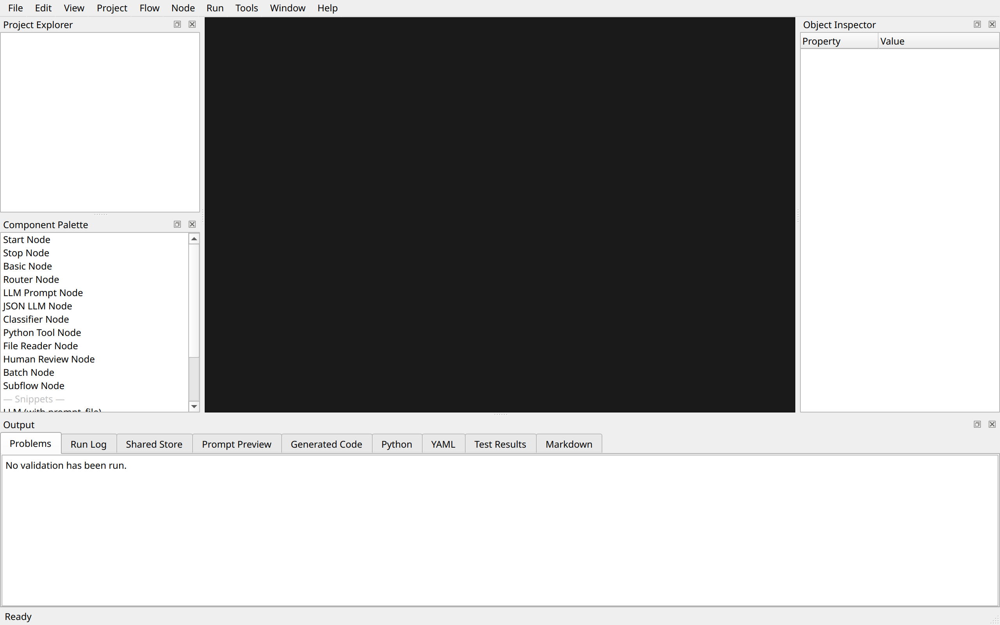

# PocketFlow Creator Help

Welcome to PocketFlow Creator — the RAD visual designer for building LLM workflows with
the [PocketFlow](https://github.com/The-Pocket/PocketFlow) framework.

---

## Getting Started

| Topic | Description |
|---|---|
| [Getting Started](getting_started.md) | Installation, first launch, and IDE overview |
| [Your First Flow](your_first_flow.md) | Build and run a Hello World flow step-by-step |
| [About PocketFlow](about_pocketflow.md) | What PocketFlow is and how it works |
| [About PocketFlow Creator](about_pocketflow_creator.md) | Architecture and design principles |

---

## Tutorials

| Tutorial Set | Topics |
|---|---|
| [Part 1 — Fundamentals](tutorials/part1_fundamentals.md) | IDE Tour, First Flow, Inspector, Code Editor, Custom Nodes, Templates |
| [Part 2 — PocketFlow Patterns](tutorials/part2_patterns.md) | Hello World, Chat, Structured Output, Routing, Agent, RAG, Batch, HITL, Judge, Multi-Agent, Streaming, Memory |
| [Part 3 — Advanced Features](tutorials/part3_advanced.md) | Validation, Debug, Subflows, Export, Shared Store, Packaging |
| [Part 4 — Exercises](tutorials/part4_exercises.md) | News Summariser, Coding Agent, Multi-Provider Router, Full IDE Workout |

See the [Tutorials Index](tutorials/index.md) for a full list.

---

## Context Help

Context help is available in every dialog via the **?** button.
You can also browse topics directly:

| Panel / Dialog | Help |
|---|---|
| Graph Canvas | [canvas.md](context/canvas.md) |
| Object Inspector | [inspector.md](context/inspector.md) |
| Component Palette | [palette.md](context/palette.md) |
| Project Explorer | [explorer.md](context/explorer.md) |
| Options | [options.md](context/options.md) |
| Provider Manager | [provider_manager.md](context/provider_manager.md) |
| Shared Store Designer | [shared_store.md](context/shared_store.md) |
| Node Type Wizard | [node_type_wizard.md](context/node_type_wizard.md) |
| Code Editor | [code_editor.md](context/code_editor.md) |
| Run Log | [run_log.md](context/run_log.md) |
| Validation | [validation.md](context/validation.md) |

---

## Keyboard Shortcuts

| Action | Shortcut |
|---|---|
| New project | Ctrl+N |
| Open project | Ctrl+O |
| Save | Ctrl+S |
| Save all | Ctrl+Shift+S |
| Undo | Ctrl+Z |
| Redo | Ctrl+Y |
| Generate code | Ctrl+G |
| Validate | Ctrl+Shift+V |
| Auto Arrange… | Ctrl+Shift+L |
| Run active flow | F5 |
| Debug active flow | Shift+F5 |
| Toggle breakpoint | F9 |
| Zoom in | Ctrl++ |
| Zoom out | Ctrl+- |
| Zoom to fit | Ctrl+0 |
| Zoom to selected node | Ctrl+Shift+Z |
| Delete selected node/edge | Delete |
| Help | F1 |
